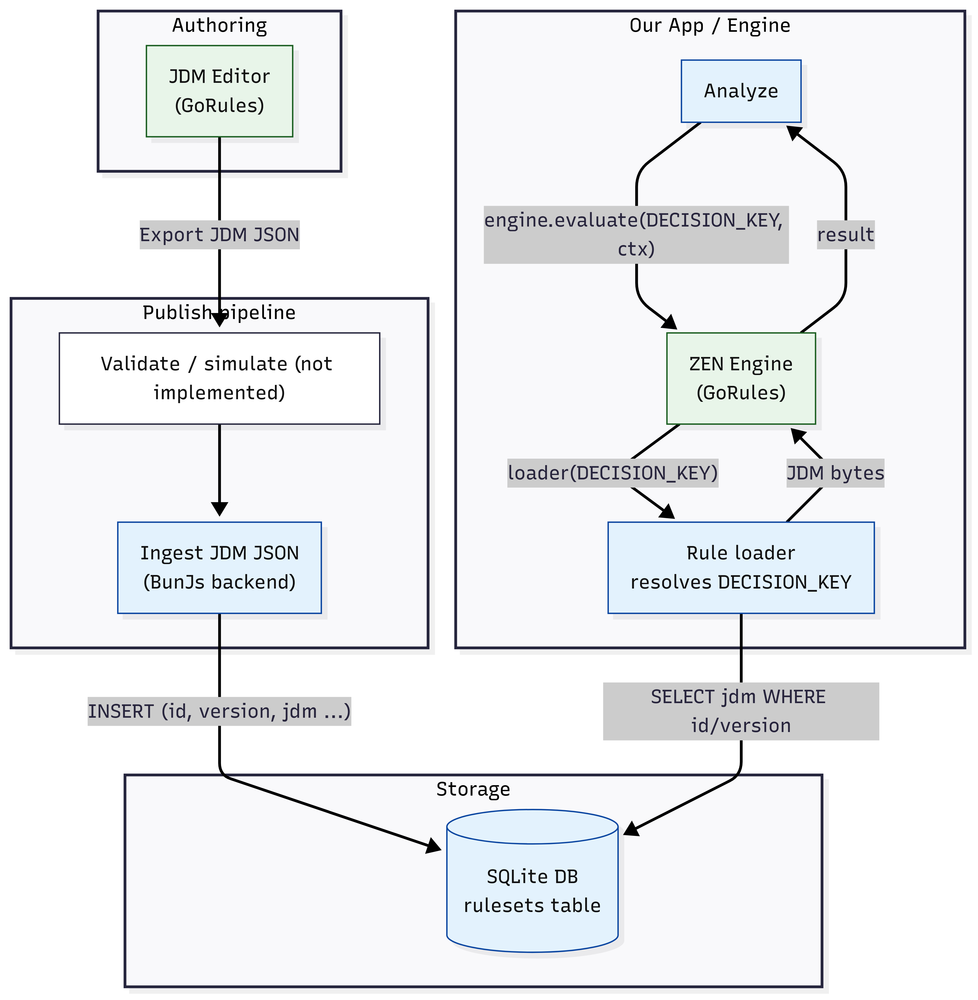

# Zen Engine Server POC

This repository provides two implementations of the same rule server that
uses [GoRules Zen Engine](https://gorules.com/):

- **`node/`** – [Bun](https://bun.sh/) TypeScript server
- **`python/`** – [FastAPI](https://fastapi.tiangolo.com/) server

Both servers share the `public/` frontend assets and `test-data/` benchmark
files.

## Architecture


## Endpoints

- `GET /editor` – React JDM editor prefilled with a sample shipping rule using
  expression nodes to compute base rates, tariffs, and totals from each part’s
  weight, cost, and origin country. It can load existing rules and publish
  updates to a local SQLite database.
- `GET /analyze` – interactive page to define property ranges, generate sample
  parts (including `origin_country`), and run them through a ruleset via Zen
  Engine. The analyzer inspects the rule's input fields to prefill compatible
  part properties.
- `GET /benchmark` – interactive page to generate random data and run
  performance comparisons.
- `POST /rulesets` – backend endpoint used by the editor to save rules. Versions
  are automatically incremented.
- `GET /rules` – list all available rule IDs.
- `GET /rules/<id>` – list versions for a rule with creation dates and status.
- `GET /rules/<id>@<ver>` – fetch a rule by key such as `shipping@latest` or
  `shipping@42`.
- `POST /benchmark/arbitrary-js` – current benchmark that measures native
  JavaScript logic versus Zen Engine expression and decision table execution.

## Running

### Bun / Node

```bash
cd node
bun install
bun run build:ui   # build frontend assets into ../public
bun run index.ts
```

### Python

```bash
cd python
pip install -r requirements.txt
uvicorn main:app --reload --port 3000
```

Either server listens on <http://localhost:3000>. Opening `/editor` loads the
JDM editor while `/analyze` allows running generated data through the rules
engine.

## Benchmarking

Benchmark implementations live in `node/benchmarks/` and a compatible Python
version of the **test-data** benchmark is exposed at `POST /benchmark/test-data`.

